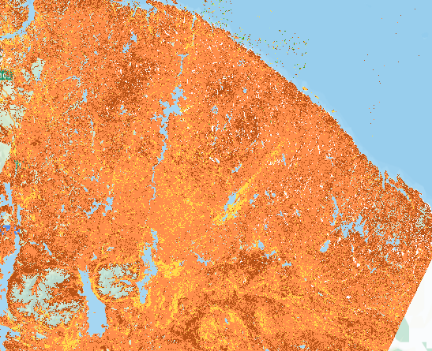
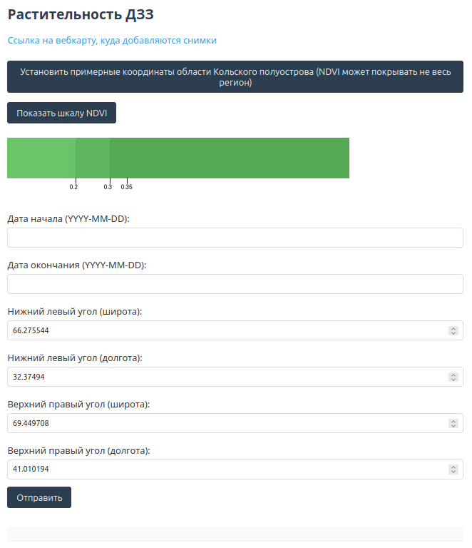

### Для работы скрипта необходимо в папке `src` в файле `secret.py` указать значения следующим переменным:

```python
# Ваше имя аккаунта на сайте EarthExplorer
EARTH_EXPLORER_USERNAME: str = None
# Ваш токен (не пароль!) для аккаунта на сайте EarthExplorer
EARTH_EXPLORER_TOKEN: str = None

# Ваше имя аккаунта на сайте Геопортала университета
GEO_PORTAL_USERNAME: str = None
# Ваш пароль для аккаунта на сайте Геопортала университета
GEO_PORTAL_PASSWORD: str = None

# ID папки на Геопортале университета, в которую будут сохраняться растровые слои с растительностью
GEO_PORTAL_RESOURCE_GROUP_ID: int = None
# ID вебкарты на Геопортале университета, на которой будут отображаться растровые слои с растительностью
GEO_PORTAL_WEB_MAP_ID: int = None
```

### Сайты

- [EarthExplorer](https://earthexplorer.usgs.gov/)
- [Регистрация на EarthExplorer](https://ers.cr.usgs.gov/register)
- [Геопортал университета](https://geo.mauniver.ru/)


---

# Растительность ДЗЗ (Дистанционное зондирование Земли)




## Описание
Необходимо разобраться с существующими методиками определения растительного покрова по материалам ДЗЗ.

Требуется определить какие необходимы:
- спутники,
- спутниковые снимки,
- алгоритмы,
- и т. п.

В рамках задачи необходимо не только разобраться, но и максимально автоматизировать все процессы:
- получение данных,
- определение растительности,
- размещение информации на геоинформационном портале университета ["Геопортал"](https://geo.mauniver.ru)

Команда
1. Логинова Ю.А. (aka ollyulia)
2. Ткачев Н.В. (aka nitkach)
3. Ольшанская Д.А. (aka oldashaa)
4. Охотников П.С. (aka P1kcho)
5. Троицкий С.А. (aka SKLrus)
