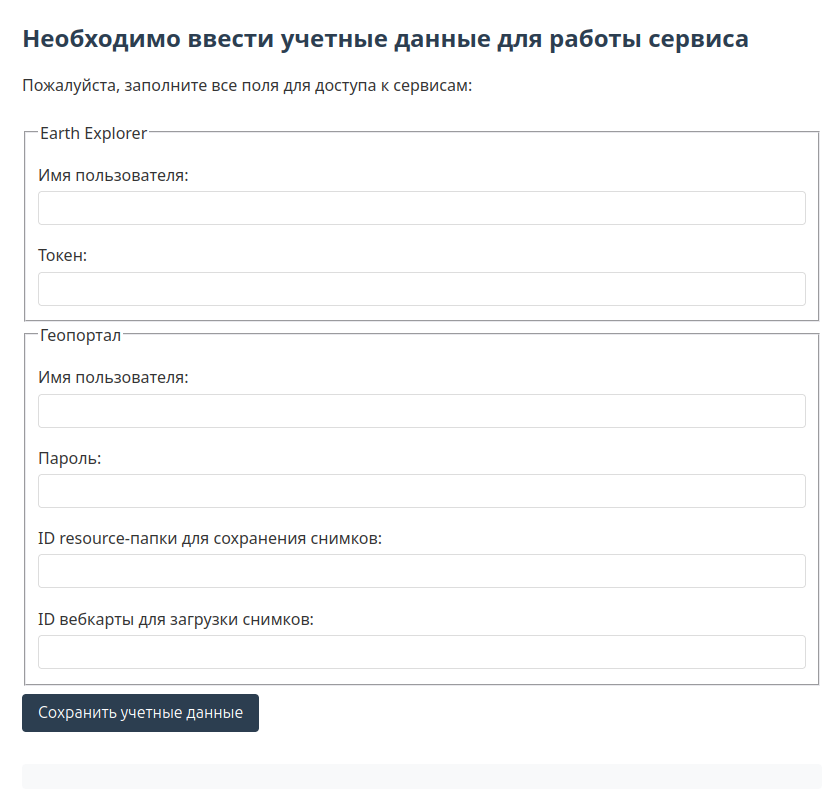

### Для работы скрипта при запуске необходимо указать следующие значения:

#### Ваше имя аккаунта на сайте EarthExplorer
#### Ваш токен (не пароль!) для аккаунта на сайте EarthExplorer

#### Ваше имя аккаунта на сайте Геопортала университета
#### Ваш пароль для аккаунта на сайте Геопортала университета

#### ID папки на Геопортале университета, в которую будут сохраняться растровые слои с растительностью
#### ID вебкарты на Геопортале университета, на которой будут отображаться растровые слои с растительностью

---

### Сайты

- [EarthExplorer](https://earthexplorer.usgs.gov/)
- [Регистрация на EarthExplorer](https://ers.cr.usgs.gov/register)
- [Геопортал университета](https://geo.mauniver.ru/)

---

# Растительность ДЗЗ (Дистанционное зондирование Земли)

## Описание
Необходимо разобраться с существующими методиками определения растительного покрова по материалам ДЗЗ.

Требуется определить какие необходимы:
- спутники,
- спутниковые снимки,
- алгоритмы,
- и т. п.

В рамках задачи необходимо не только разобраться, но и максимально автоматизировать все процессы:
- получение данных,
- определение растительности,
- размещение информации на геоинформационном портале университета ["Геопортал"](https://geo.mauniver.ru)

Команда
1. Логинова Ю.А. (aka ollyulia)
2. Ткачев Н.В. (aka nitkach)
3. Ольшанская Д.А. (aka oldashaa)
4. Охотников П.С. (aka P1kcho)
5. Троицкий С.А. (aka SKLrus)
