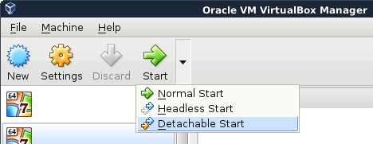
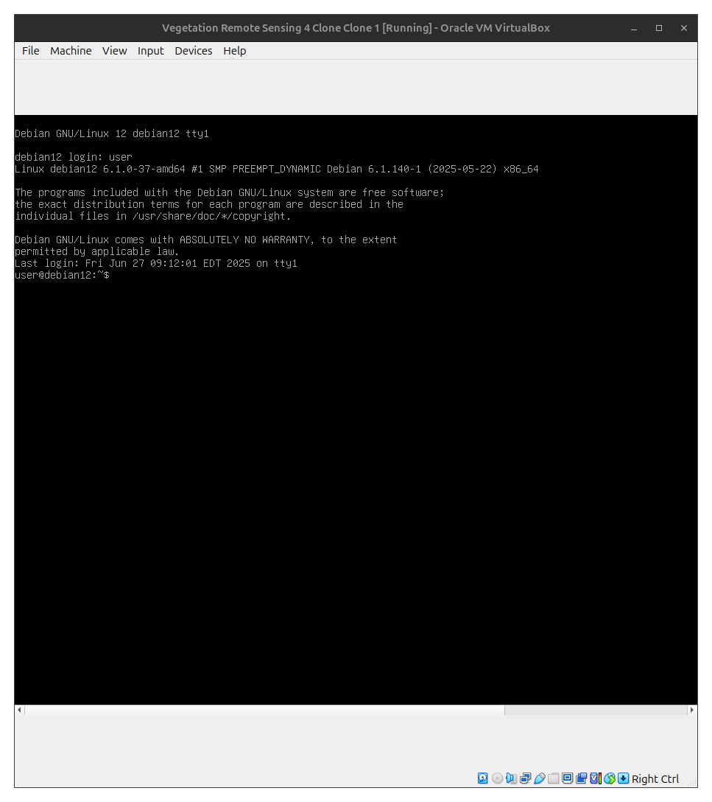
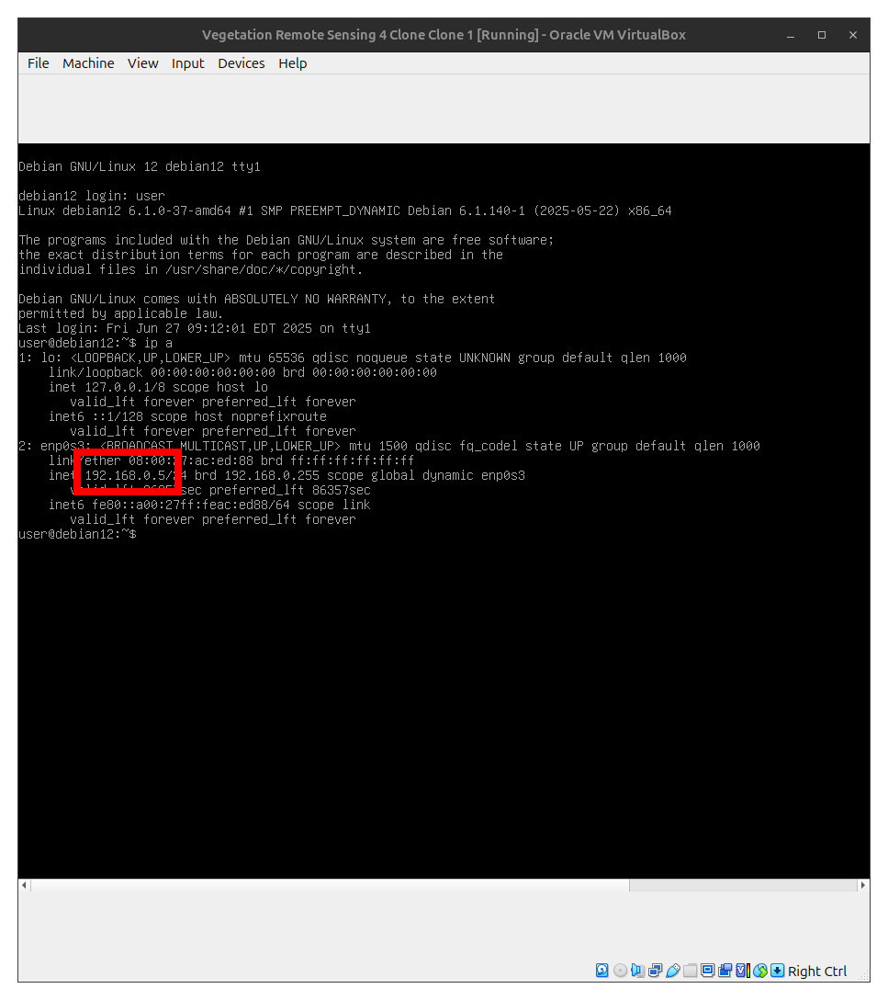
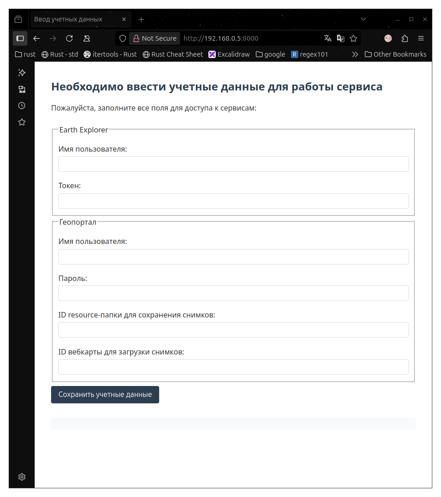
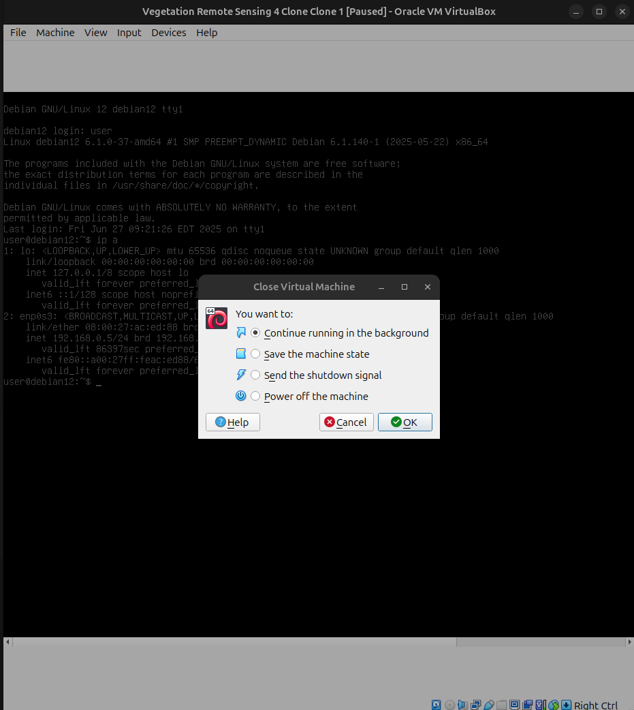

## Имея образ виртуальной машины, нужно:

1) Скачать образ, использовать его для создания виртуальной машины и запустить её в режиме "Detachable Start"

2) Зайти в виртуальную машину, появится GRUB, подождать пока запуститься система. Ввести логин `user` при запросе системы:

3) Узнать адрес виртуальной машины с помощью команды `ip a` (в текущем случае это `192.168.0.5`)

4) В веб-браузере host-машины ввести адрес и добавить порт `8000`

5) Окно виртуальной машины можно закрыть, но нужно выбрать "Продолжить работу в фоновом режиме"

6) Сервис будет доступен по тому же адресу, пока запущена виртуальная машина

---

### Для работы скрипта при запуске необходимо указать следующие значения:


#### Ваше имя аккаунта на сайте EarthExplorer
#### Ваш токен (не пароль!) для аккаунта на сайте EarthExplorer

#### Ваше имя аккаунта на сайте Геопортала университета
#### Ваш пароль для аккаунта на сайте Геопортала университета

#### ID папки на Геопортале университета, в которую будут сохраняться растровые слои с растительностью
#### ID вебкарты на Геопортале университета, на которой будут отображаться растровые слои с растительностью

---

### Сайты

- [EarthExplorer](https://earthexplorer.usgs.gov/)
- [Регистрация на EarthExplorer](https://ers.cr.usgs.gov/register)
- [Геопортал университета](https://geo.mauniver.ru/)

---

# Растительность ДЗЗ (Дистанционное зондирование Земли)


## Описание
Необходимо разобраться с существующими методиками определения растительного покрова по материалам ДЗЗ.

Требуется определить какие необходимы:
- спутники,
- спутниковые снимки,
- алгоритмы,
- и т. п.

В рамках задачи необходимо не только разобраться, но и максимально автоматизировать все процессы:
- получение данных,
- определение растительности,
- размещение информации на геоинформационном портале университета ["Геопортал"](https://geo.mauniver.ru)

Команда
1. Логинова Ю.А. (aka ollyulia)
2. Ткачев Н.В. (aka nitkach)
3. Ольшанская Д.А. (aka oldashaa)
4. Охотников П.С. (aka P1kcho)
5. Троицкий С.А. (aka SKLrus)

---

Создайте виртуальную машину Debian

```bash
# Adding user to sudo group
su -
apt-get install sudo
usermod -a -G sudo user
# Ctrl + D
# Restart system

sudo apt install apache2
sudo apt install -y git

sudo mkdir -p /var/www/vegetation_rs
sudo chown -R $USER:$USER /var/www/vegetation_rs

cd /var/www/vegetation_rs/
git clone https://github.com/ollyulia/Vegetation_DZZ.git .

sudo apt install -y python3-venv
python3 -m venv venv
source venv/bin/activate
pip install -r requirements.txt

sudo nano /etc/apache2/sites-available/vegetation_rs.conf
<VirtualHost *:80>
    ServerName vegetation_rs.local

    ProxyPass / http://127.0.0.1:8000/
    ProxyPassReverse / http://127.0.0.1:8000/
</VirtualHost>

sudo a2enmod proxy proxy_http
sudo a2ensite vegetation_rs.conf
sudo systemctl restart apache2

uvicorn wsgi:app --host 0.0.0.0 --port 8000
```
